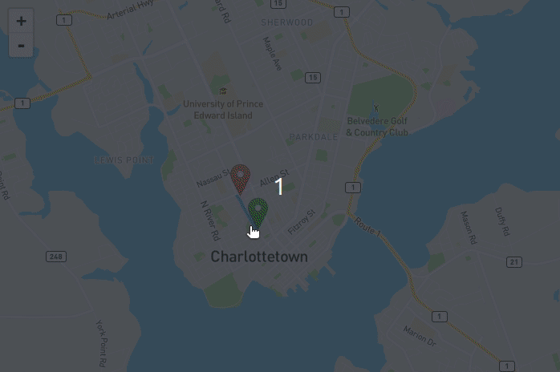

# National Road Network (NRN) Routing Application

A proof-of-concept that uses the National Road Network to build a point-to-point routing application using Dijkstra's Shortest Path Algorithm on top of GeoServer and PostgreSQL/PostGIS Docker containers.

## Requirements
* Geospatial Data Abstraction Library (GDAL) 3 - `ogr2ogr`
* Docker and Docker-Compose
* Python 3.*

## Getting Started

### 1. Build the Docker containers for GeoServer and PostGIS.

`$ docker-compose up --build -d`

### 2. Download the NRN road network, build the network costs and interact with the GeoServer RESTful API.

`$ ./build.sh [ab,bc,mb,nb,nl,ns,on,pe,qc,sk,nt,nu,yk]`

Example:
`$ ./build nb`

### 3. View the web map using Python HTTPServer.

`$ python3 -m http.server 8000`

Enter, http://localhost:8000, in a browser of your choice.

## To Do:
* Integrate functionality for other provinces.
* Further testing of routing algorithms.

## Acknowledgements
* [kartoza/docker-postgis](https://github.com/kartoza/docker-postgis)
* [kartoza/docker-geoserver](https://github.com/kartoza/docker-geoserver)
* [thegisdev/leaflet-pgrouting-geoserver](https://github.com/thegisdev/leaflet-pgrouting-geoserver)
